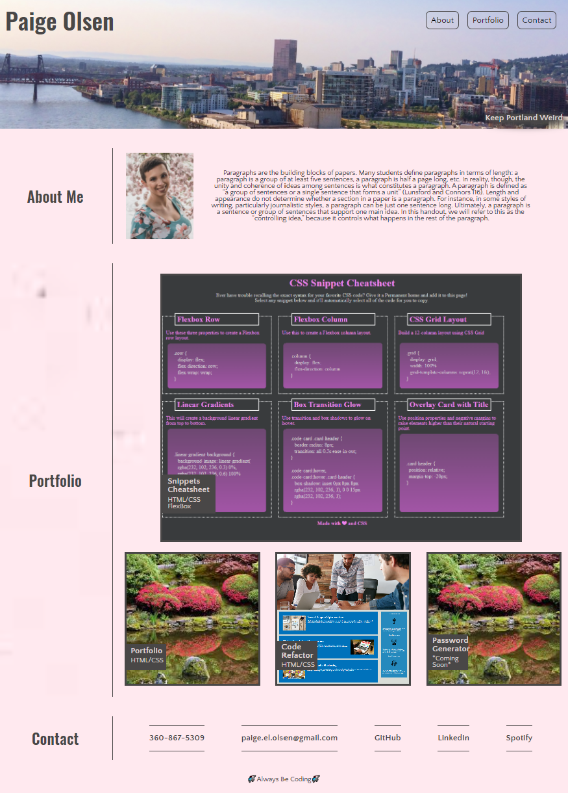

# My Portfolio

<details>
<summary>
```
For this project I have created a portfolio which highlights my style as well as providing functionality for employers to preview my work. 
- As the screen changes size the format of the website adjusts to make reading a delight. 
- The navigation options change border and background color when hovered over and will take the reader to the designated portions of the webpage
- The portfolio images change border color when hovered over them and when clicked will take the reader to my github repo for this project and the deployed site for others. 
- Within the contact portion of the webpage there are several available methods to contact me. If one clicks on my email it will open their default email. The GitHub and LinkedIn buttons will take the reader to the relevant profile pages in a separate browser tab.
```
</summary>
</details
## User Story

```
AS AN employer
I WANT to view a potential employee's deployed portfolio of work samples
SO THAT I can review samples of their work and assess whether they're a good candidate for an open position
```


## Acceptance Criteria

Here are the critical requirements necessary to develop a portfolio that satisfies a typical hiring manager’s needs:

```
GIVEN I need to sample a potential employee's previous work
WHEN I load their portfolio
THEN I am presented with the developer's name, a recent photo or avatar, and links to sections about them, their work, and how to contact them
WHEN I click one of the links in the navigation
THEN the UI scrolls to the corresponding section
WHEN I click on the link to the section about their work
THEN the UI scrolls to a section with titled images of the developer's applications
WHEN I am presented with the developer's first application
THEN that application's image should be larger in size than the others
WHEN I click on the images of the applications
THEN I am taken to that deployed application
WHEN I resize the page or view the site on various screens and devices
THEN I am presented with a responsive layout that adapts to my viewport
```


## ScreenShot of WebPage



## URL of WebPage

https://polsen-92.github.io/portfolio/
